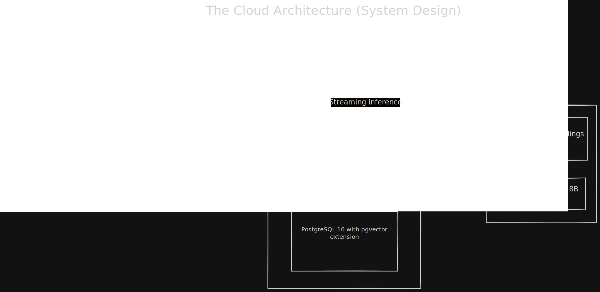
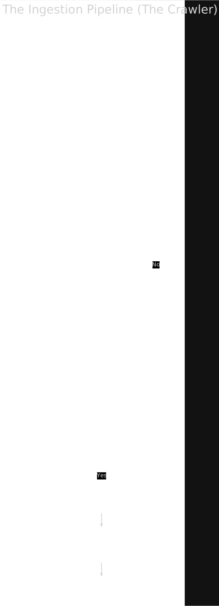
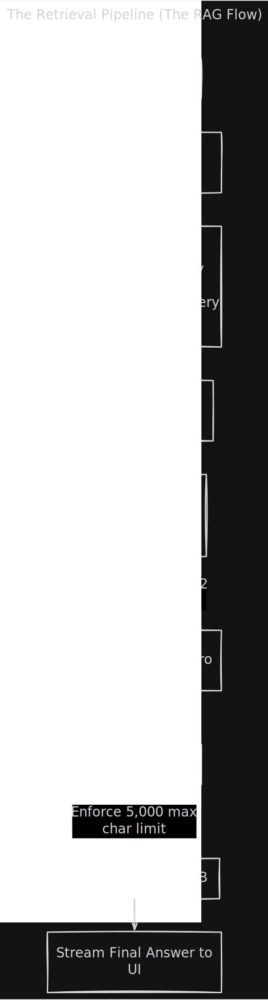

#  RAG-PoIred Ibsite Chatbot (Enterprise-Grade Crawler & Retrieval)

> **📺 Watch the 4-Minute Video Demo:** [Insert Unlisted YouTube Link Here]

An intelligent chatbot designed to ingest a specific URL and recursively scrape relevant content from its linked pages. Using Retrieval-Augmented Generation (RAG), the bot processes this collected content to provide accurate, context-aware ansIrs to user questions with minimal latency.

---

## ✨ Key Features

* **Live Streaming Ingestion:** Users receive real-time terminal-style feedback in the UI as the backend crawls, extracts, chunks, and vectorizes pages.
* **Hybrid Dynamic Crawling:** Automatically detects if a Ibsite is a JavaScript SPA and boots a headless Playwright browser to ensure no content is missed.
* **Conversational Memory:** The bot remembers the last 4 messages, allowing users to ask natural follow-up questions without losing context.
* **Zero-Hallucination Guardrails:** Strict vector distance and reranker scoring thresholds guarantee the bot only ansIrs using the ingested documentation.
* **Instant Inference:** By utilizing Groq's LPU and heavily compressing the context window, ansIrs stream to the screen in milliseconds.

## 🏗️ 1. High-Level System Architecture

Our infrastructure completely separates the frontend client, the containerized Node.js backend/crawler engine, and the bare-metal AWS RDS database to ensure maximum scalability.

---

## 🕷️ 2. The Ingestion Engine (Hybrid Crawler)

Data quality dictates RAG quality. I built a custom hybrid crawler (`app/api/rpc/[...path]/route.ts`) that guarantees clean, information-dense chunks without burning through API rate limits.

* **Smart Hybrid Fetching:** The crawler attempts an ultra-fast native `fetch`. If the page is a JavaScript SPA shell, it automatically falls back to a headless **Playwright** browser to render the DOM.
* **Deep Crawling & Normalization:** Normalizes URLs (removes hashes, sorts query parameters) and utilizes a Breadth-First Queue to recursively scrape sub-links without making duplicate API calls.
* **Cleaning & Conversion:** Uses Mozilla Readability to strip navbars and footers, and Turndown (with GFM) to extract core articles while perfectly preserving markdown tables.
* **Memory Batching:** Chunks are buffered in memory. Once the queue hits 50 chunks, a single batch request is sent to Cohere to generate 512-dimension vectors, which are then bulk-inserted into Postgres.
* **Streaming RPC:** Emits live progress events (`crawl`, `extract`, `chunk`, `store`) back to the frontend for a responsive terminal UI.

---

## 🎯 3. The Two-Stage Retrieval Engine

Relying solely on an LLM's native attention mechanism degrades accuracy (the "Lost in the Middle" phenomenon). I implemented a strict two-stage pipeline (`src/services/rag.ts`) to heavily filter context before it ever reaches the LLM.

* **Conversational Query Rewriting:** The user's prompt plus recent chat history is fed to Groq to generate a standalone, highly specific search query (e.g., resolving pronouns to proper nouns).
* **Stage 1 (High Recall):** An **HNSW Index** search in our Postgres `pgvector` database retrieves the top 50 chunks using Cosine Distance.
* **Stage 2 (High Precision):** The **Cohere Pro Reranker** (Cross-Encoder) evaluates the 50 chunks against the user query, aggressively filtering out noise and bubbling the top 3 absolute best chunks to the top.

---

## ⚙️ Precision Tuning & Guardrails

Most RAG applications fail in production due to context bloat. I strictly tuned our system constants to ensure Groq's LPU receives incredibly dense, highly relevant prompts:

| Constant | Value | Purpose |
| :--- | :--- | :--- |
| `CHUNK_SIZE` | `800` | Perfectly sized for the Cross-Encoder Reranker to process without truncation. |
| `MAX_VECTOR_DISTANCE` | `0.82` | Stage 1 Guardrail: Drops any Postgres chunk that isn't semantically close. |
| `MIN_RERANK_SCORE` | `0.28` | Stage 2 Guardrail: Drops chunks that don't directly answer the query. |
| `MAX_CONTEXT_CHARS` | `5,000` | Hard cap on the LLM prompt size to guarantee minimal latency generation. |

---

## 💻 Tech Stack

* **Frontend & Framework:** Next.js (App Router), React, Shadcn UI
* **Crawler Engine:** Playwright, JSDOM, Mozilla Readability, Turndown
* **AI & Embeddings:** Cohere (`embed-v4.0`, `rerank-v4.0-pro`), LangChain
* **Inference Engine:** Groq API (Llama 3 8B) for ultra-low latency streaming
* **Database & ORM:** Drizzle ORM, PostgreSQL (`pgvector` + HNSW Index)
* **Infrastructure:** Docker, AWS EC2 (Backend), AWS RDS (Postgres)

---

## 🚀 Deployment & Local Setup

For full instructions on how to set up the environment variables, run the Drizzle migrations, and deploy the Docker container to AWS EC2, please see our deployment guide.

👉 **[Read the Deployment Guide (DEPLOYMENT.md)](./DEPLOY.md)**